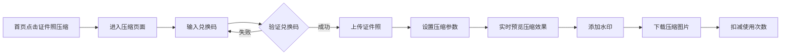

# 证件照压缩工具 - 产品需求文档

## 1. 产品概述
在现有心理测试中心项目中新增证件照压缩工具功能模块。用户通过兑换码验证后，可上传证件照进行压缩，支持自定义压缩尺寸和质量，预览时自动添加水印，满足各类证件照上传要求。

## 2. 核心功能

### 2.1 功能模块
1. **用户端首页(home.html)**: 新增证件照压缩工具入口卡片
2. **证件照压缩页面**: 兑换码验证、图片上传压缩、带水印预览、下载
3. **管理后台(admin.html)**: 新增证件照压缩相关配置选项

### 2.2 页面详情
| 页面名称 | 模块名称 | 功能描述 |
|---------|---------|---------|
| 用户端首页 | 测试卡片区域 | 新增"证件照压缩"卡片入口，跳转到压缩页面 |
| 证件照压缩页面 | 兑换码验证区 | 输入兑换码、验证状态提示、剩余使用次数显示 |
| 证件照压缩页面 | 图片上传区 | 支持拖拽上传、点击上传，显示上传进度和图片预览 |
| 证件照压缩页面 | 压缩参数设置 | 设置目标文件大小(KB)、输出尺寸(宽×高)、图片质量 |
| 证件照压缩页面 | 预览对比 | 原图与压缩后图片对比展示，**压缩图自动添加水印**，显示文件大小变化 |
| 证件照压缩页面 | 下载功能 | 一键下载压缩后的证件照(带水印)，支持多种格式输出 |
| 管理后台 | 测试配置 | 新增"id-photo-compress"测试类型配置 |
| 管理后台 | 兑换码管理 | 支持生成可用于证件照压缩的兑换码 |

## 3. 核心流程

### 3.1 用户使用流程
从首页进入 → 输入兑换码 → 验证通过 → 上传证件照 → 设置压缩参数 → 预览压缩效果(带水印) → 下载压缩图片

## 4. 用户界面设计

### 4.1 设计风格
- **与现有首页风格保持一致**
- **主色调**: 专业蓝(#2563EB) + 纯净白(#FFFFFF) + 柔和灰(#F3F4F6)
- **辅助色**: 成功绿(#10B981)、警告橙(#F59E0B)、错误红(#EF4444)
- **按钮风格**: 圆角按钮(8px)，带有微妙阴影和hover效果
- **字体**: 与现有项目保持一致
- **布局风格**: 居中卡片式布局，清晰的视觉层次

### 4.2 页面设计概览
| 页面名称 | 模块名称 | UI元素 |
|---------|---------|--------|
| 用户端首页 | 测试卡片 | 新增卡片：图标📸、名称"证件照压缩"、描述、标签"✨ 新功能" |
| 证件照压缩页面 | 兑换码验证区 | 输入框、验证按钮、状态提示、剩余次数徽章 |
| 证件照压缩页面 | 图片上传区 | 虚线边框拖拽区、上传图标、支持格式提示 |
| 证件照压缩页面 | 压缩参数设置 | 目标大小滑块、尺寸输入框、质量滑块、预设尺寸快捷按钮(1寸、2寸、小2寸) |
| 证件照压缩页面 | 预览对比 | 原图预览框、压缩图预览框(带水印)、文件大小对比标签、压缩率显示 |
| 证件照压缩页面 | 下载功能 | 下载按钮、格式选择下拉框、重置按钮 |

### 4.3 水印设计
- **水印内容**: "仅供预览" 或自定义文字
- **水印位置**: 图片右下角，半透明
- **水印样式**: 斜体、灰色、30%透明度
- **水印作用**: 仅在预览时显示，下载时可选择是否保留水印

### 4.4 响应式设计
- 桌面优先设计，支持1440px及以上大屏
- 平板适配(768px-1024px): 调整卡片宽度和间距
- 移动端适配(375px-768px): 垂直堆叠布局，优化触控体验

### 4.5 交互细节
- 兑换码验证成功显示绿色勾选动画，失败显示红色错误提示
- 上传区域hover时边框高亮，拖拽时显示半透明遮罩
- 压缩参数实时响应，滑块拖动时即时更新预览
- 压缩完成时显示成功动画和压缩率徽章
- 水印在压缩过程中自动添加到预览图
