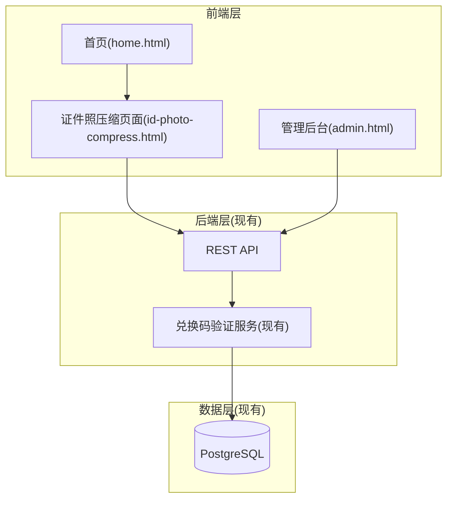
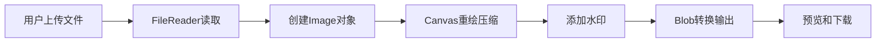

# 证件照压缩工具 - 技术架构文档

## 1. 架构设计

本项目为现有心理测试中心项目的新增功能模块，复用现有的兑换码验证系统和后端架构。



## 2. 技术说明
- **前端框架**: 纯HTML + JavaScript (与现有项目保持一致)
- **样式方案**: 内联CSS + style.css (与现有项目保持一致)
- **后端框架**: Express@4 (现有)
- **数据库**: PostgreSQL (现有)
- **图片处理**: Canvas API (前端压缩)
- **水印处理**: Canvas API (前端添加水印)
- **兑换码验证**: 复用现有验证系统

## 3. 文件结构

### 3.1 新增文件
```
frontend/
├── id-photo-compress.html      # 证件照压缩页面
└── js/
    └── id-photo-compress.js    # 压缩功能逻辑
```

### 3.2 修改文件
```
frontend/
├── home.html                   # 添加证件照压缩卡片入口
└── js/
    └── admin.js                # 添加id-photo-compress测试类型支持

backend/
└── prisma/
    └── schema.prisma           # 添加id-photo-compress测试类型(如需要)
```

## 4. 路由定义

### 4.1 前端路由
| 路由 | 用途 |
|-----|------|
| /id-photo-compress.html | 证件照压缩页面 |

### 4.2 API路由(复用现有)
| 路由 | 方法 | 用途 |
|-----|------|------|
| /api/verify-code | POST | 验证兑换码(现有) |
| /api/use-code | POST | 使用兑换码(现有) |
| /api/test-result | POST | 提交测试结果(现有) |

## 5. 核心功能实现

### 5.1 图片压缩算法
```javascript
// 压缩流程
1. 使用FileReader读取上传的图片文件
2. 创建Image对象获取原始尺寸
3. 根据目标尺寸计算压缩比例
4. 使用Canvas重绘图片到目标尺寸
5. 通过二分查找调整quality参数控制文件大小
6. 转换为Blob输出
```

### 5.2 水印添加算法
```javascript
// 水印流程
1. 在Canvas上绘制压缩后的图片
2. 设置水印样式(字体、颜色、透明度)
3. 在指定位置(右下角)绘制水印文字
4. 转换为Blob输出
```

### 5.3 预设尺寸
| 尺寸名称 | 宽度(px) | 高度(px) | 用途 |
|---------|---------|---------|------|
| 1寸 | 295 | 413 | 标准一寸照 |
| 2寸 | 413 | 626 | 标准二寸照 |
| 小2寸 | 413 | 531 | 小二寸照(护照等) |
| 自定义 | 用户输入 | 用户输入 | 自定义尺寸 |

## 6. 数据流设计



## 7. 兑换码验证集成

复用现有兑换码验证系统：
- 验证接口: `/api/verify-code`
- 使用接口: `/api/use-code`
- 测试类型: `id-photo-compress`

验证流程：
1. 用户输入兑换码
2. 调用验证接口，传入 `{ code: "兑换码", testType: "id-photo-compress" }`
3. 验证成功后显示剩余次数
4. 下载时调用使用接口扣减次数

## 8. 管理后台集成

### 8.1 测试配置
在现有测试配置中新增：
- 测试名称: 证件照压缩
- TypeKey: id-photo-compress
- 页面文件名: id-photo-compress.html

### 8.2 兑换码管理
- 支持生成可用于证件照压缩的兑换码
- 支持设置使用范围包含 id-photo-compress

## 9. 性能优化
- 图片压缩在前端完成，减轻服务器压力
- 使用requestAnimationFrame优化实时预览
- 压缩结果缓存，避免重复计算
- 大文件提示用户等待，显示进度

## 10. 安全考虑
- 前端文件大小限制: 最大10MB
- 支持格式限制: JPEG、PNG、WebP
- 兑换码验证防止未授权使用
- 水印防止滥用预览图
